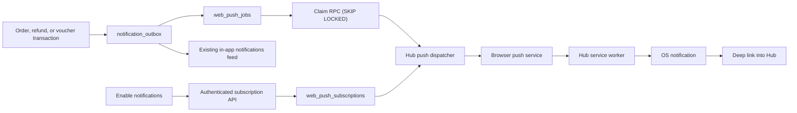

# Spec: Hub Web Push Notifications — iOS and Android

**Package:** `packages/hub-page`  
**Supporting package:** `packages/backend` only if the production scheduler
cannot invoke Hub every minute  
**Status:** Ready for review  
**Delivery standard:** W3C Web Push with VAPID; no native application or
platform-specific notification SDK

---

## 0. Outcome and non-negotiable truths

Hub is already an installable PWA with a manifest, a registered service
worker, offline caching, and an in-app `notification_outbox`. This work adds
real operating-system notifications without replacing any of those pieces.

The product outcome:

> A signed-in user can explicitly enable notifications on each device and
> receive timely, actionable Hub updates while the web app is closed.

The system invariants:

1. Push is always opt-in. Permission is requested only after a direct user
   action; never automatically on page load.
2. In-app notifications remain the source of truth. Push is a best-effort
   delivery channel pointing back to that truth.
3. One user can have multiple devices and one device can change signed-in
   users safely.
4. A push-provider success means “accepted by the provider”, not “read by the
   person”. Product state must never depend on push delivery.
5. Delivery is retryable and auditable. A transient provider outage cannot
   silently lose a queued push.
6. A permanently invalid subscription is automatically disabled.
7. Notification payloads are server-authored from a template allowlist. No
   database metadata is copied blindly onto a lock screen.
8. Transactional and marketing consent are separate. Phase 1 contains no
   marketing push.

## 1. Platform contract

### iPhone and iPad

- Requires iOS/iPadOS 16.4 or newer.
- Hub must be added to the Home Screen and opened in standalone mode.
- The permission request must result from the user tapping an explicit
  “Enable notifications” control inside the installed app.
- Notifications can appear on the Lock Screen, in Notification Center, under
  Focus rules, and on a paired Apple Watch.
- Standards-based Web Push uses Apple's push service internally. An Apple
  Developer Program membership is not required.

If Hub is open in an iOS browser but is not installed, show installation
instructions instead of attempting to request push permission.

### Android

- Use feature detection for `serviceWorker`, `PushManager`, and
  `Notification`; do not browser-sniff for support.
- Installed PWA is the preferred experience. Browsers that support Web Push
  without installation may also subscribe.
- Permission must still be triggered by a user action.

### Shared requirements

- Production must use HTTPS.
- Every accepted push must produce a user-visible notification.
- Silent/background-only push is out of scope.
- A permission denial must be respected. Hub must not repeatedly prompt the
  user; it should explain how to re-enable permission in device settings.

References:

- https://webkit.org/blog/13878/web-push-for-web-apps-on-ios-and-ipados/
- https://developer.mozilla.org/en-US/docs/Web/API/Push_API
- https://developer.mozilla.org/en-US/docs/Web/API/ServiceWorkerRegistration/showNotification

## 2. Scope

### Phase 1 notification categories

| Category | Events | Default deep link |
|---|---|---|
| Orders | placed, accepted, dispatched, delivered, digital delivery, cancelled | `/me/orders` |
| Refunds | initiated, completed, failed/manual review | `/me/orders` |
| Vouchers | asynchronous purchase ready, purchase failed or requires support | `/vouchers/{voucher_id}` |

These are transactional notifications: they report a user-initiated purchase
or a material change to something the user owns.

### Explicitly deferred

- Merchant promotions, campaigns, recommendations, and “come back” messages.
- Quest reminders and streak nudges.
- Scheduled local notifications.
- Notification action buttons such as “Accept” or “Redeem”.
- Rich media.
- Email and SMS.

Rewards and quest notifications can use this same delivery backbone later,
but require separate product decisions about frequency and marketing consent.

## 3. Existing system and required correction

Existing pieces:

- `src/app/manifest.ts`: standalone PWA manifest.
- `src/components/ServiceWorkerRegister.tsx`: registers `/sw.js`.
- `public/sw.js`: offline page/asset caching.
- `notification_outbox`: durable records displayed by
  `/me/notifications`.

`notification_outbox.status` cannot be reused as the push delivery state.
Some current order producers insert in-app rows as `status = 'sent'` because
the record itself is immediately visible in Hub; others remain `pending`.
Neither value proves an external push was attempted.

Decision:

> `notification_outbox` remains the canonical user-visible event. New
> `web_push_jobs` and `web_push_deliveries` tables own external delivery.

This also preserves the notifications feed when permission is denied, a
subscription expires, or a push provider is unavailable.

## 4. Architecture



The database transaction that creates the in-app notification also creates
the push job. Network delivery happens asynchronously after commit.

## 5. Data model

Implement in a new Supabase migration after the voucher spend-intent
migration.

### 5.1 `web_push_subscriptions`

One row per browser/OS push subscription.

```sql
create table web_push_subscriptions (
  id                  uuid primary key default gen_random_uuid(),
  hub_user_id         uuid not null references auth.users(id) on delete cascade,
  installation_id     uuid not null,
  endpoint             text not null,
  endpoint_hash        text not null unique,
  p256dh                text not null,
  auth_secret          text not null,
  platform             text not null
                         check (platform in ('ios', 'android', 'desktop', 'unknown')),
  user_agent           text,
  status               text not null default 'active'
                         check (status in ('active', 'revoked', 'expired')),
  failure_count        integer not null default 0,
  last_success_at      timestamptz,
  last_failure_at      timestamptz,
  last_seen_at         timestamptz not null default now(),
  revoked_at           timestamptz,
  created_at           timestamptz not null default now(),
  updated_at           timestamptz not null default now()
);

create index idx_web_push_subscriptions_user_active
  on web_push_subscriptions(hub_user_id)
  where status = 'active';
```

Rules:

- `endpoint_hash = encode(digest(endpoint, 'sha256'), 'hex')`.
- The raw endpoint and encryption keys are service-only capability data.
- Re-subscribing the same endpoint updates keys, `installation_id`,
  `hub_user_id`, platform, and `last_seen_at`. This safely transfers a shared
  browser installation to the currently authenticated account.
- `installation_id` is generated once in the browser and stored locally. It
  is not an authentication credential.
- RLS enabled; no direct access for `anon` or `authenticated`. Authenticated
  API routes use the service-role client after verifying the session.

### 5.2 `hub_notification_preferences`

Preferences apply to all of a user's subscribed devices.

```sql
create table hub_notification_preferences (
  hub_user_id       uuid primary key references auth.users(id) on delete cascade,
  orders_enabled    boolean not null default true,
  vouchers_enabled  boolean not null default true,
  rewards_enabled   boolean not null default false,
  marketing_enabled boolean not null default false,
  updated_at         timestamptz not null default now()
);
```

The existence of preferences is not notification permission. With no active
subscription, nothing is sent.

### 5.3 `notification_outbox` additions

```sql
alter table notification_outbox
  add column hub_user_id uuid references auth.users(id),
  add column category text,
  add column deep_link text;
```

New constraints:

- `category` is one of `orders`, `refunds`, `vouchers`, `rewards`,
  `marketing`.
- `deep_link` must start with `/` and must not start with `//`.
- New producers should write `hub_user_id` directly whenever it is known.

For legacy order producers that only have `user_ref`, add a server-side
resolver which checks, in order:

1. exact Hub user UUID;
2. case-insensitive `auth.users.email`;
3. case-insensitive `hub_user_wallets.address`.

Zero matches leaves `hub_user_id` null and preserves the in-app row. More
than one match is a reconciliation error and must not enqueue a push.

Do not mass-push historical outbox rows after migration.

### 5.4 `web_push_jobs`

One durable job per push-eligible in-app notification.

```sql
create table web_push_jobs (
  id                  uuid primary key default gen_random_uuid(),
  notification_id     uuid not null unique references notification_outbox(id),
  hub_user_id         uuid not null references auth.users(id) on delete cascade,
  status              text not null default 'pending'
                        check (status in (
                          'pending', 'processing', 'retry',
                          'completed', 'suppressed', 'dead'
                        )),
  attempts            integer not null default 0,
  available_at        timestamptz not null default now(),
  processing_started_at timestamptz,
  completed_at        timestamptz,
  last_error          text,
  created_at          timestamptz not null default now(),
  updated_at          timestamptz not null default now()
);

create index idx_web_push_jobs_claim
  on web_push_jobs(status, available_at, created_at);
```

An `AFTER INSERT` trigger on `notification_outbox` inserts this job only when:

- `hub_user_id` resolves;
- the template is in the push allowlist;
- the category is transactional in Phase 1.

The trigger does not require an active subscription. The dispatcher records
`completed/no_active_subscriptions` if none exist at claim time.

### 5.5 `web_push_deliveries`

One attempt record per job and subscription. This makes multi-device partial
success safe to retry.

```sql
create table web_push_deliveries (
  id               uuid primary key default gen_random_uuid(),
  job_id           uuid not null references web_push_jobs(id) on delete cascade,
  subscription_id  uuid not null references web_push_subscriptions(id),
  status           text not null default 'pending'
                     check (status in ('pending', 'accepted', 'retry', 'gone', 'failed')),
  attempts         integer not null default 0,
  provider_status  integer,
  last_error       text,
  accepted_at      timestamptz,
  created_at       timestamptz not null default now(),
  updated_at       timestamptz not null default now(),
  unique(job_id, subscription_id)
);
```

Retain jobs/deliveries for 90 days, then delete them in batches. Revoked
subscription capability data may be deleted after 30 days.

## 6. Database RPC contract

### `claim_web_push_jobs(p_limit integer, p_worker_id text)`

- Re-arms `processing` jobs older than 10 minutes.
- Claims `pending|retry` rows whose `available_at <= now()`.
- Uses `FOR UPDATE SKIP LOCKED`.
- Sets `status = 'processing'`, increments attempts, and records claim time.
- Returns notification ID, user ID, template, category, deep link, and
  metadata required by the server template renderer.

### `complete_web_push_job(...)`

One guarded RPC records the aggregate result:

- all deliveries accepted/gone/permanently failed → `completed`;
- user preference disabled → `suppressed`;
- no active subscriptions → `completed`;
- any transient delivery remains and attempts < 8 → `retry`;
- attempts exhausted → `dead`.

Retry delays: 1m, 2m, 5m, 15m, 30m, 1h, 3h, 6h.

The RPC must not overwrite a terminal `completed|suppressed|dead` job on a
late retry.

## 7. Browser subscription UX

Add `PushNotificationSettings.tsx` to `/me/notifications`.

### States

| State | UI |
|---|---|
| Unsupported | “Notifications aren’t supported by this browser.” |
| iOS, not installed | “Add Akiba to your Home Screen to enable notifications” plus existing Share instructions |
| Permission `default` | “Enable notifications” button and a short transactional-use explanation |
| Permission `granted`, unsubscribed | “Turn on notifications for this device” |
| Permission `granted`, subscribed | Enabled state, category toggles, “Turn off on this device” |
| Permission `denied` | Explain how to enable Hub in OS/browser notification settings; do not call the permission API again |

The permission request occurs inside the click handler:

1. Wait for `navigator.serviceWorker.ready`.
2. Call `Notification.requestPermission()`.
3. If granted, call `registration.pushManager.subscribe()` with
   `userVisibleOnly: true` and the VAPID public key.
4. POST the resulting `PushSubscriptionJSON` to the authenticated API.
5. Show success only after the server stores it.

Do not combine the install prompt and permission prompt. On iOS the user must
complete installation, open the installed app, and then explicitly enable
notifications.

### Logout and account switching

Before normal logout:

1. Read the current service-worker subscription.
2. DELETE it from Hub while the old session is still authenticated.
3. Call `subscription.unsubscribe()`.
4. Continue logout even if either cleanup step fails.

On every authenticated app launch, if a local subscription exists, POST it
again. The endpoint upsert binds it to the current Hub user and refreshes
`last_seen_at`, closing the account-switching gap left by an interrupted
logout.

## 8. HTTP API

All user routes require a valid Supabase session, same-origin `Origin`, JSON
content type, strict body limits, and service-role writes after authentication.

### `GET /api/me/push`

Returns:

```json
{
  "enabled": true,
  "vapid_public_key": "...",
  "preferences": {
    "orders": true,
    "vouchers": true,
    "rewards": false,
    "marketing": false
  }
}
```

Never returns stored endpoints or encryption keys.

### `POST /api/me/push/subscriptions`

Input:

```json
{
  "installation_id": "uuid",
  "platform": "ios",
  "subscription": {
    "endpoint": "https://...",
    "expirationTime": null,
    "keys": { "p256dh": "...", "auth": "..." }
  }
}
```

Validation:

- HTTPS endpoint only.
- `endpoint`, `p256dh`, and `auth` required with conservative maximum lengths.
- Valid UUID installation ID.
- Supported platform enum only.
- Rate limit per authenticated user and IP.

Response: `{ "ok": true }`.

### `DELETE /api/me/push/subscriptions`

Input contains the current subscription endpoint. It may revoke only a row
owned by the authenticated user. Response is idempotent.

### `PATCH /api/me/push/preferences`

Allows only the known boolean preference keys. Rewards and marketing cannot
be enabled until those push categories are separately designed and released.

### `GET|POST /api/internal/process-push-jobs`

- `GET`: `Authorization: Bearer <CRON_SECRET>`.
- `POST`: `x-webhook-secret: <INTERNAL_WEBHOOK_SECRET>`.
- Batch size 25 jobs with bounded per-invocation concurrency.
- `export const dynamic = "force-dynamic"`.
- Add to `packages/hub-page/vercel.json` at one-minute cadence where the
  deployment scheduler supports it. Otherwise invoke this same endpoint
  every minute from the always-on backend scheduler; do not create a second
  delivery implementation.

Target: 95% of newly queued pushes accepted by a provider within two minutes.

## 9. Push rendering and service-worker contract

Install `web-push` in `packages/hub-page`. Configure it with:

- `NEXT_PUBLIC_WEB_PUSH_VAPID_PUBLIC_KEY`
- `WEB_PUSH_VAPID_PRIVATE_KEY`
- `WEB_PUSH_VAPID_SUBJECT` (a `mailto:` or HTTPS contact)
- existing `CRON_SECRET` / `INTERNAL_WEBHOOK_SECRET`

The private key exists only in server environments.

### Server-authored payload

```json
{
  "v": 1,
  "notificationId": "uuid",
  "title": "Your voucher is ready",
  "body": "Open Akiba to show its QR code.",
  "url": "/vouchers/uuid",
  "tag": "notification:uuid",
  "category": "vouchers"
}
```

Maximum payload target: 3 KB. Do not include wallet addresses, email,
payment references, full order contents, voucher codes, or secrets.

Templates are TypeScript functions keyed by the allowlisted
`notification_outbox.template`. Unknown templates are marked `suppressed`
rather than sent with raw metadata.

### `public/sw.js`

Retain the existing caching behavior and add:

- `push` listener:
  - parse and validate payload version;
  - require a relative same-origin deep link;
  - call `self.registration.showNotification(...)`;
  - use `/icons/icon-192.png` as `icon`;
  - add a monochrome badge asset suitable for Android;
  - use `tag = notification:{id}` to collapse retry duplicates;
  - update app badge when supported.
- `notificationclick` listener:
  - close the notification;
  - find and focus an existing same-origin Hub window;
  - navigate it to the validated deep link, or `clients.openWindow(url)`.

Malformed push data must still produce a generic visible notification such
as “You have a new Akiba update” linking to `/me/notifications`. This meets
the user-visible push requirement and prevents bad data from silently waking
the service worker.

Never fetch protected API data inside the `push` handler merely to construct
the notification; the server payload is already sufficient.

## 10. Delivery semantics

Use at-least-once transport with visible de-duplication:

- `notification_outbox.dedupe_key` prevents duplicate product events.
- `web_push_jobs.notification_id UNIQUE` prevents duplicate jobs.
- `(job_id, subscription_id) UNIQUE` prevents duplicate delivery records.
- notification `tag` collapses any provider-level retry duplicate on device.

Provider response handling:

| Result | Action |
|---|---|
| 2xx | Delivery `accepted`; reset subscription failure count |
| 404 or 410 | Delivery `gone`; subscription → `expired` |
| 408, 429, or 5xx | Delivery `retry`; backoff |
| Other 4xx caused by invalid subscription | Delivery `failed`; subscription → `revoked` |
| Configuration/authentication error affecting all sends | Re-arm job and alert; do not revoke every subscription |

The dispatcher must distinguish a global VAPID/configuration failure from a
bad individual endpoint.

## 11. Notification templates

Phase 1 copy is intentionally short because it appears on lock screens.

| Template | Title | Body |
|---|---|---|
| `order_placed` | Order received | We’ve received your Akiba order. |
| `order_accepted` | Order accepted | The merchant has accepted your order. |
| `order_dispatched` | Order on the way | Your order has been dispatched. |
| `order_delivered` | Order delivered | Confirm receipt when you have your order. |
| `digital_delivered` | Digital order ready | Your digital order has been fulfilled. |
| `order_cancelled` | Order cancelled | Open Akiba to see the order and refund status. |
| `refund_initiated` | Refund started | Your refund is being processed. |
| `refund_completed` | Refund completed | Your refund has been completed. |
| `voucher_ready` | Your voucher is ready | Open Akiba to show its QR code. |
| `voucher_failed` | Voucher purchase not completed | You were not charged. Open Akiba for details. |
| `voucher_reconciliation` | Voucher purchase needs review | Your Miles are protected while we verify the transaction. |

Copy must avoid exposing purchase details on a locked phone.

Voucher notification creation belongs in the spend-intent database
finalizers:

- ledger-only finalization → `voucher_ready`;
- confirmed on-chain finalization → `voucher_ready`;
- definitive failure → `voucher_failed`;
- ambiguous chain result → `voucher_reconciliation`.

Each uses `dedupe_key = 'notif:voucher:' || voucher_id || ':' || template`.

## 12. Security and privacy

- Treat endpoints and `p256dh`/`auth` keys as secrets; service-role only.
- Validate same-origin `Origin` on cookie-authenticated mutation routes to
  prevent cross-site subscription changes.
- Do not log raw endpoints, keys, payloads, wallet addresses, or emails.
  Log subscription/job UUIDs and endpoint hashes only.
- Deep links are selected by server template code and must be relative paths.
- Push content contains no authentication state and grants no access. Opening
  a protected deep link still goes through normal Hub authentication.
- A service worker update must not weaken the existing “never cache API/auth
  routes” rule.
- Disabling notifications revokes the server row even if browser
  `unsubscribe()` fails.
- Push permission is not marketing consent.

## 13. Observability and operations

Track:

- active subscriptions by platform;
- subscription enable/deny/disable events;
- queued jobs and oldest eligible job age;
- accepted, retried, gone, suppressed, and dead delivery counts;
- provider response classes;
- endpoint expiry rate;
- median and p95 event-to-provider-acceptance latency.

Alerts:

- oldest eligible job > 10 minutes;
- dead jobs > 5 in 15 minutes;
- provider acceptance below 90% over 30 minutes;
- a sudden 401/403 response spike (usually VAPID/configuration);
- no successful sends across all platforms for one hour while jobs exist.

Add a protected operational summary endpoint or include these counts in the
existing reconciliation tooling.

## 14. Testing

### Unit

- feature detection and iOS standalone gating;
- permission state UI;
- VAPID key conversion;
- strict subscription payload validation;
- notification template rendering and deep-link allowlist;
- provider response classification;
- service-worker payload fallback and click routing.

### Route

- unauthenticated subscription/preference mutations return 401;
- cross-origin mutation rejected;
- valid subscription upserts idempotently;
- endpoint rebinds to the currently authenticated account;
- user cannot revoke another endpoint without possessing and owning it;
- rewards and marketing preferences cannot be enabled in Phase 1;
- cron/internal secrets enforced.

### PostgreSQL integration

- notification and push job commit atomically;
- duplicate outbox event creates one push job;
- unresolved/ambiguous recipient creates no push job;
- concurrent claims never claim the same job;
- partial multi-device failure retries only the failed delivery;
- terminal completion is idempotent;
- stale processing job is re-armed;
- disabled preference suppresses delivery;
- historical outbox rows are not enqueued during migration.

### Real-device acceptance

Test at minimum:

1. iPhone on iOS 16.4+:
   - browser state shows install instructions;
   - installed Hub requests permission from a button;
   - notification arrives while Hub is closed;
   - tap opens the correct protected page;
   - denied permission is handled without repeat prompts.
2. Android Chrome:
   - install and subscribe;
   - background notification and deep link;
   - subscription survives browser/app restart.
3. Multi-device:
   - one user receives the event on two active devices.
4. Shared device:
   - user A logs out, user B logs in, and user A no longer receives push on
     that installation.
5. Invalid endpoint:
   - simulated 410 deactivates only that subscription.
6. Provider outage:
   - event stays in the in-app feed and push retries later.

## 15. Rollout

1. Deploy additive schema and dormant delivery code.
2. Configure VAPID keys and verify `/api/me/push` readiness in production.
3. Release the settings UI to internal accounts only.
4. Test Android, then iOS Home Screen installation on physical devices.
5. Enable order/refund templates for a small user cohort.
6. Enable voucher-ready/failure templates.
7. Expand to all users after seven days of healthy delivery metrics.
8. Design quest/reward frequency and marketing consent separately.

Rollback:

- Disable the push-job creation feature flag.
- Leave subscriptions and in-app notifications intact.
- Existing pending jobs may be marked `suppressed` in one guarded operation.
- Do not roll back the service worker to a version that removes caching
  behavior or strands an incompatible cache.

## 16. Definition of done

- A user can enable and disable push per device.
- iOS installed Hub and Android receive a notification while closed.
- Notification tap opens the correct Hub destination.
- Every push corresponds to a durable in-app notification.
- Multi-device fan-out works.
- Logout/account switching does not leak one user's pushes to another.
- Retries, provider expiry, and partial delivery are durable and observable.
- Push failure never changes order, voucher, refund, quest, or payment state.
- No marketing push is possible without a separate consented release.
- All unit, route, database integration, and physical-device acceptance tests
  above pass.

## 17. Implementation order

1. Migration: normalized recipient, subscriptions, preferences, jobs,
   deliveries, claim/complete RPCs.
2. VAPID configuration and server-side template renderer.
3. Authenticated subscription/preferences APIs.
4. Service-worker push/click handlers and manifest `id`/`scope`.
5. Notification settings UI and logout/account-rebind behavior.
6. Dispatcher endpoint, one-minute schedule, retries, metrics.
7. Existing order/refund producer normalization.
8. Voucher spend-intent notification producers.
9. Automated tests, physical-device matrix, staged rollout.
